# Coffee Shop Sales — SQL Analysis Case Study

An end-to-end SQL case study on a coffee shop's transaction data, answering nine core business questions using MySQL. Each section below includes the business requirement, the query, and the query output (captured directly from MySQL Workbench).

**Dataset:** `Coffee Shop Sales.xlsx` — `coffee_shop_sales` table (`transaction_id`, `transaction_date`, `transaction_time`, `store_location`, `product_category`, `product_type`, `transaction_qty`, `unit_price`)

---

## 01 — Executive Snapshot
**Business Requirement:** Determine the overall sales performance by calculating total revenue, total transactions, and total units sold.

```sql
SELECT
    SUM(transaction_qty * unit_price) AS total_sales,
    COUNT(DISTINCT transaction_id) AS total_transactions,
    SUM(transaction_qty) AS total_units_sold
FROM coffee_shop_sales;
```

| total_sales | total_transactions | total_units_sold |
|---|---|---|
| 698812.00 | 149116 | 214470 |

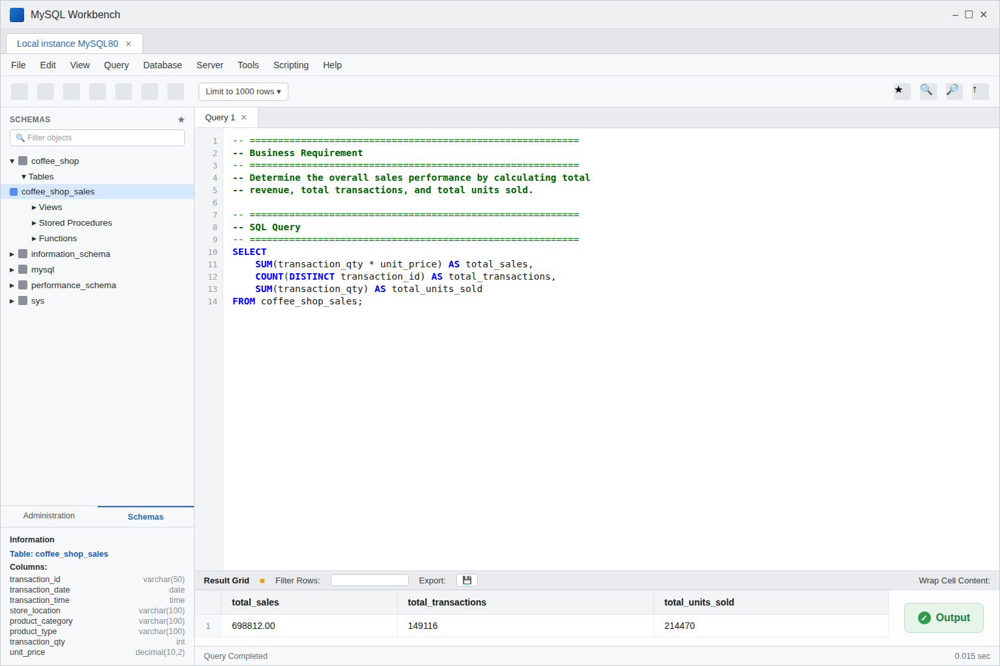

---

## 02 — Which Store Leads?
**Business Requirement:** Identify which store location generates the highest total revenue.

```sql
SELECT
    store_location,
    SUM(transaction_qty * unit_price) AS total_sales
FROM coffee_shop_sales
GROUP BY store_location
ORDER BY total_sales DESC;
```

| store_location | total_sales |
|---|---|
| Hell's Kitchen | 236511.00 |
| Astoria | 232244.00 |
| Lower Manhattan | 230057.00 |

**Takeaway:** Hell's Kitchen leads revenue — but only narrowly.

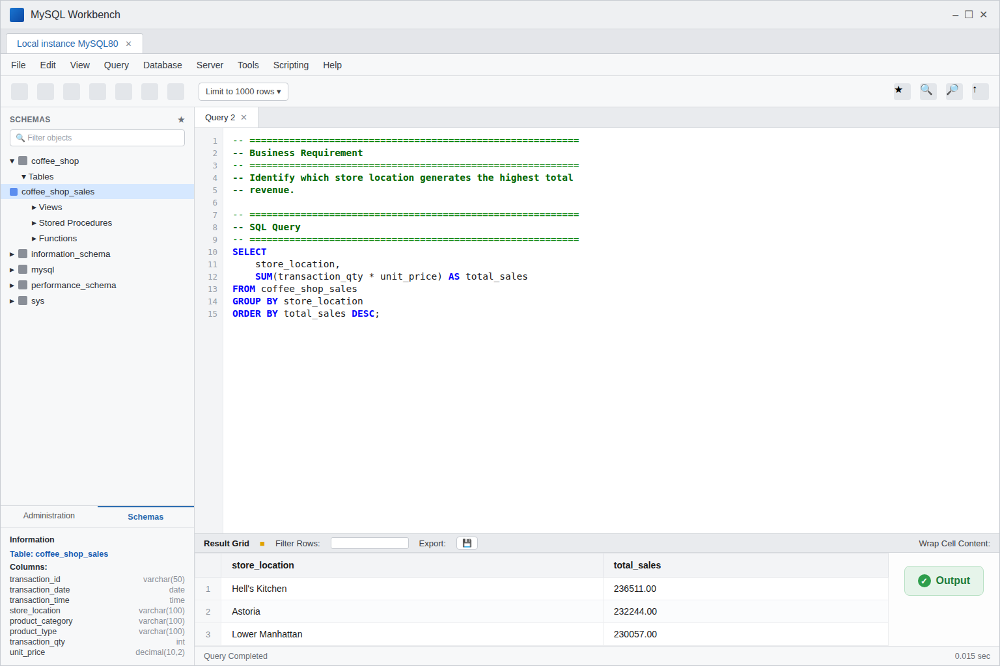

---

## 03 — Category Battle
**Business Requirement:** Determine which product category generates the highest total revenue.

```sql
SELECT
    product_category,
    SUM(transaction_qty * unit_price) AS total_sales
FROM coffee_shop_sales
GROUP BY product_category
ORDER BY total_sales DESC;
```

| product_category | total_sales |
|---|---|
| Coffee | 269952.00 |
| Tea | 196406.00 |
| Bakery | 82316.00 |
| Drinking Chocolate | 72416.00 |
| Coffee beans | 40085.00 |
| Branded | 13607.00 |
| Loose Tea | 11214.00 |
| Flavours | 8409.00 |
| Packaged Chocolate | 4408.00 |

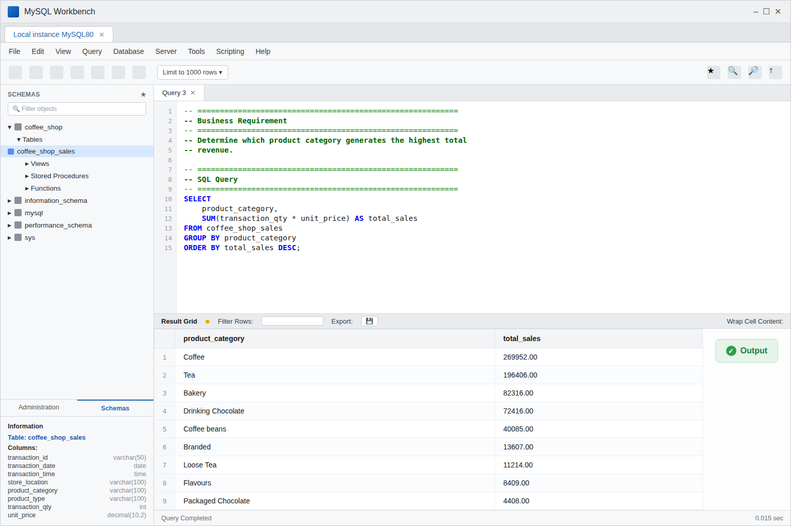

---

## 04 — The Sales Calendar
**Business Requirement:** Analyze the monthly sales trend to identify when revenue peaks throughout the year.

```sql
SELECT
    DATE_FORMAT(transaction_date, '%b %Y') AS month_year,
    SUM(transaction_qty * unit_price) AS total_sales
FROM coffee_shop_sales
GROUP BY DATE_FORMAT(transaction_date, '%b %Y'), MONTH(transaction_date)
ORDER BY MONTH(transaction_date);
```

| month_year | total_sales |
|---|---|
| Jan 2023 | 81678.00 |
| Feb 2023 | 76145.00 |
| Mar 2023 | 98835.00 |
| Apr 2023 | 118941.00 |
| May 2023 | 156728.00 |
| Jun 2023 | 166486.00 |

**Takeaway:** Revenue climbed sharply from February → June, with June as the peak month.

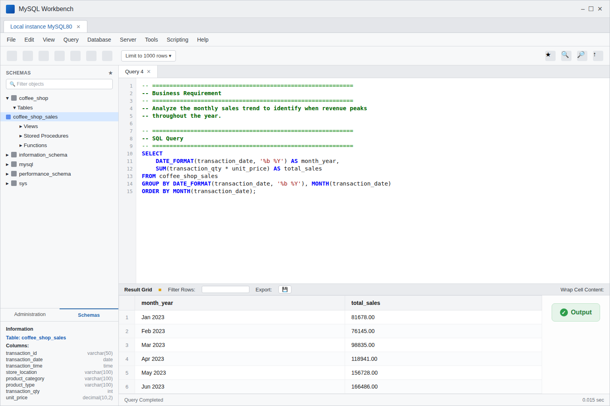

---

## 05 — Peak Selling Hours
**Business Requirement:** Find the peak selling hours of the day to help plan staffing schedules.

```sql
SELECT
    HOUR(transaction_time) AS hour_of_day,
    SUM(transaction_qty * unit_price) AS total_sales
FROM coffee_shop_sales
GROUP BY HOUR(transaction_time)
ORDER BY total_sales DESC;
```

| hour_of_day | total_sales |
|---|---|
| 10 | 88673.00 |
| 9 | 85170.00 |
| 8 | 82700.00 |
| 7 | 63526.00 |

**Takeaway:** Morning hours dominate sales.

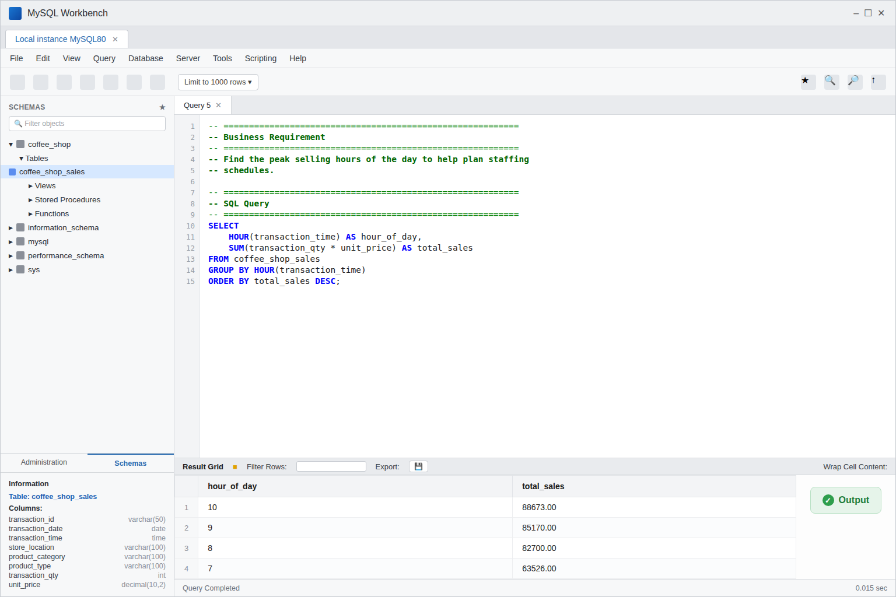

---

## 06 — Which Day Wins?
**Business Requirement:** Determine the best-performing day of the week for sales.

```sql
SELECT
    DAYNAME(transaction_date) AS day_of_week,
    SUM(transaction_qty * unit_price) AS total_sales
FROM coffee_shop_sales
GROUP BY DAYNAME(transaction_date), DAYOFWEEK(transaction_date)
ORDER BY total_sales DESC;
```

| day_of_week | total_sales |
|---|---|
| Monday | 101677.00 |
| Friday | 101373.00 |
| Thursday | 100768.00 |
| Wednesday | 100314.00 |
| Tuesday | 99456.00 |
| Sunday | 98330.00 |
| Saturday | 96894.00 |

**Takeaway:** Monday narrowly leads the week.

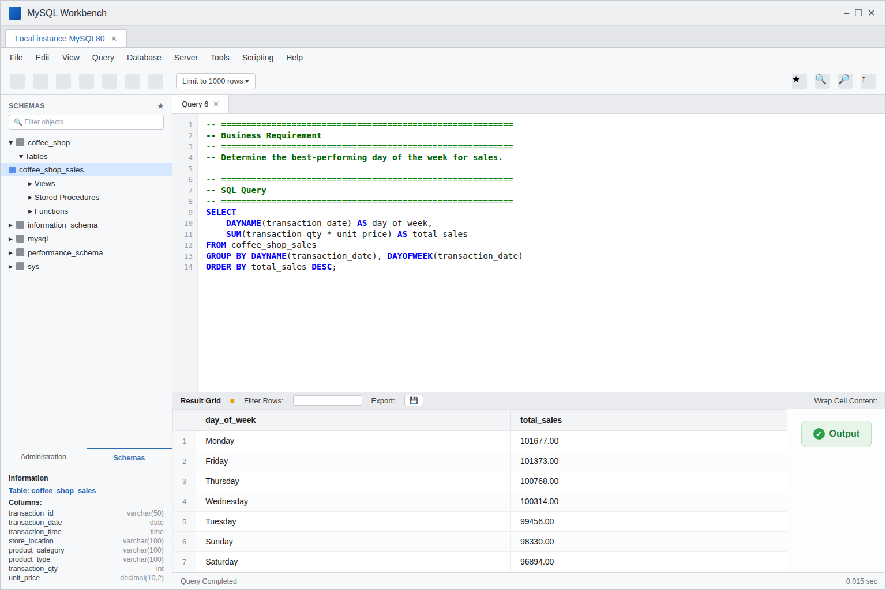

---

## 07 — Store × Category: Coffee & Tea
**Business Requirement:** Analyze store performance by product category (Coffee & Tea) to see what each store is really good at.

```sql
SELECT
    store_location,
    SUM(CASE WHEN product_category = 'Coffee'
        THEN transaction_qty * unit_price ELSE 0 END) AS coffee_sales,
    SUM(CASE WHEN product_category = 'Tea'
        THEN transaction_qty * unit_price ELSE 0 END) AS tea_sales,
    SUM(CASE WHEN product_category = 'Bakery'
        THEN transaction_qty * unit_price ELSE 0 END) AS bakery_sales,
    SUM(CASE WHEN product_category = 'Drinking Chocolate'
        THEN transaction_qty * unit_price ELSE 0 END) AS chocolate_sales
FROM coffee_shop_sales
GROUP BY store_location;
```

| store_location | coffee_sales | tea_sales |
|---|---|---|
| Astoria | 89744.00 | 67840.00 |
| Hell's Kitchen | 91223.00 | 64701.00 |
| Lower Manhattan | 88986.00 | 63865.00 |

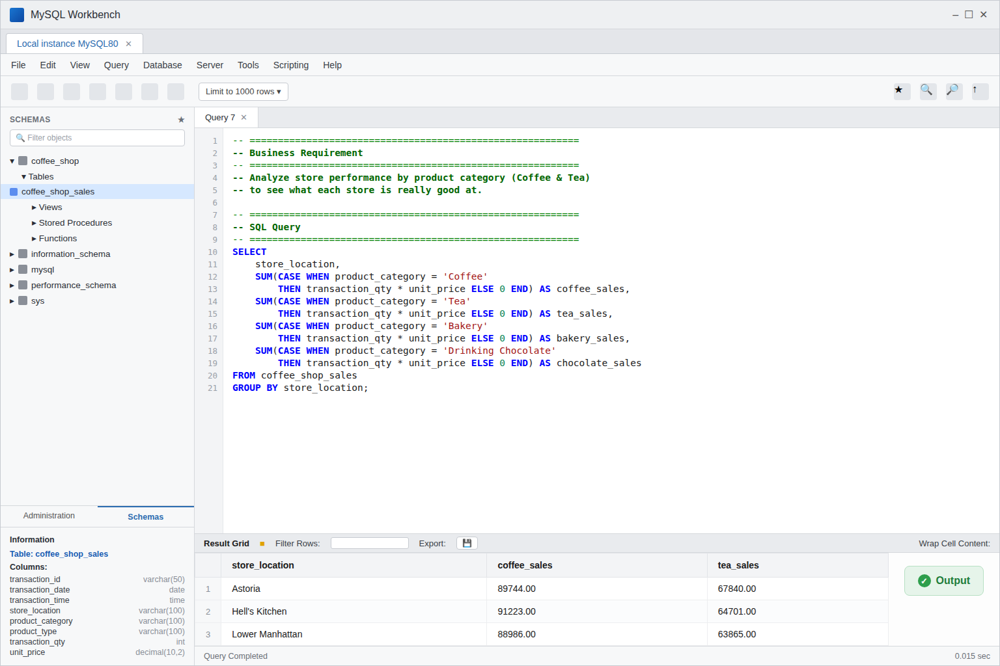

---

## 08 — Store × Category: Bakery & Drinking Chocolate
**Business Requirement:** Analyze store performance by product category (Bakery & Drinking Chocolate) to see what each store is really good at.

*(Same query as above, viewed with the remaining two category columns.)*

| store_location | bakery_sales | chocolate_sales |
|---|---|---|
| Astoria | 26600.00 | 26335.00 |
| Hell's Kitchen | 27387.00 | 23586.00 |
| Lower Manhattan | 28329.00 | 22495.00 |

**Takeaway:** Hell's Kitchen leads in Coffee, Lower Manhattan leads in Bakery, and Astoria leads in Drinking Chocolate.

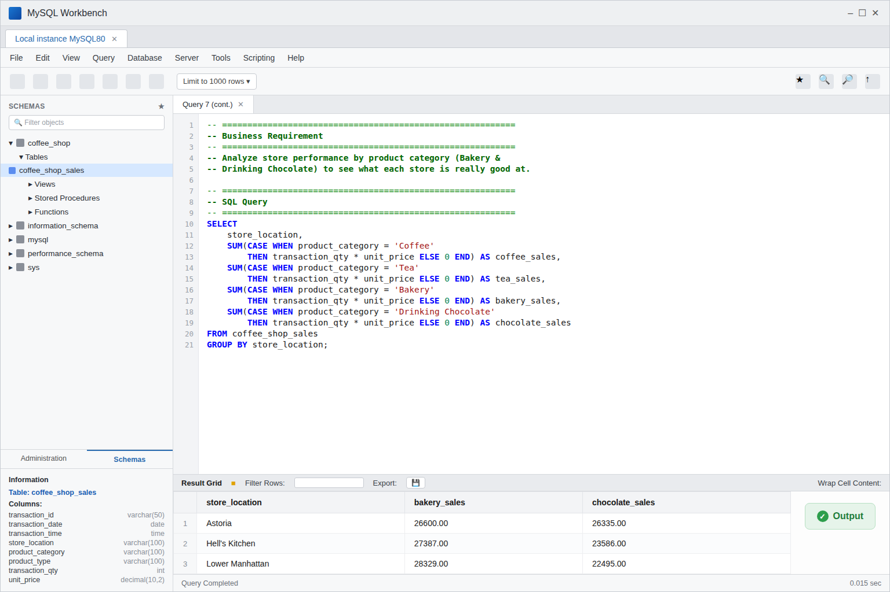

---

## 09 — The Coffee Specialist
**Business Requirement:** Identify which store is the "Coffee Specialist" by comparing Coffee transaction volume across locations.

```sql
SELECT
    store_location,
    product_category,
    COUNT(transaction_id) AS total_transactions
FROM coffee_shop_sales
WHERE product_category IN ('Coffee', 'Drinking Chocolate')
GROUP BY store_location, product_category
ORDER BY product_category, total_transactions DESC;
```

| store_location | product_category | total_transactions |
|---|---|---|
| Hell's Kitchen | Coffee | 20187 |
| Astoria | Coffee | 20025 |
| Lower Manhattan | Coffee | 18204 |

**Takeaway:** Hell's Kitchen is the Coffee Specialist.

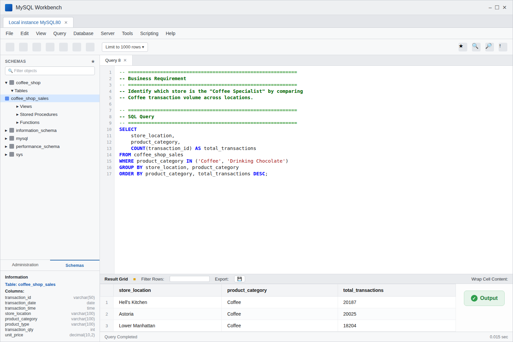

---

## 10 — The Chocolate Leader
**Business Requirement:** Identify which store is the "Chocolate Leader" by comparing Drinking Chocolate transaction volume across locations.

*(Same query as above, filtered to the Drinking Chocolate rows.)*

| store_location | product_category | total_transactions |
|---|---|---|
| Astoria | Drinking Chocolate | 4300 |
| Hell's Kitchen | Drinking Chocolate | 3763 |
| Lower Manhattan | Drinking Chocolate | 3405 |

**Takeaway:** Astoria is the Chocolate Leader.

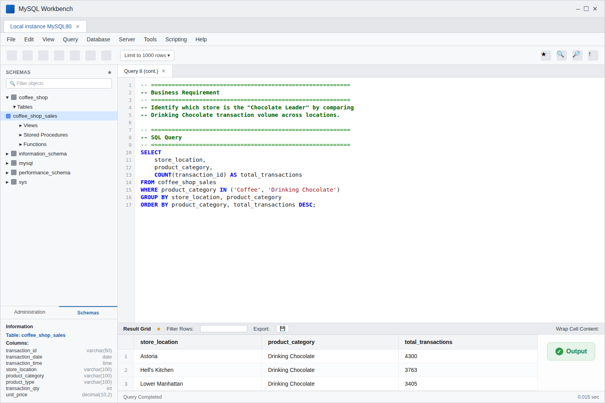

---

## 11 — Price Segmentation
**Business Requirement:** Segment products into price tiers (Low, Medium, Premium) based on unit price.

```sql
SELECT
    product_type,
    unit_price,
    CASE
        WHEN unit_price <= 5 THEN 'Low'
        WHEN unit_price > 5 AND unit_price <= 10 THEN 'Medium'
        ELSE 'Premium'
    END AS price_tier
FROM coffee_shop_sales
GROUP BY product_type, unit_price
ORDER BY unit_price ASC;
```

| product_type | unit_price | price_tier |
|---|---|---|
| Scone | 3.00 | Low |
| Drip coffee | 4.50 | Low |
| Latte | 5.75 | Medium |
| Chai tea | 6.75 | Medium |
| Hot chocolate | 9.25 | Medium |
| Espresso Roast beans 1kg | 17.00 | Premium |
| Sustainably grown beans 1kg | 20.00 | Premium |

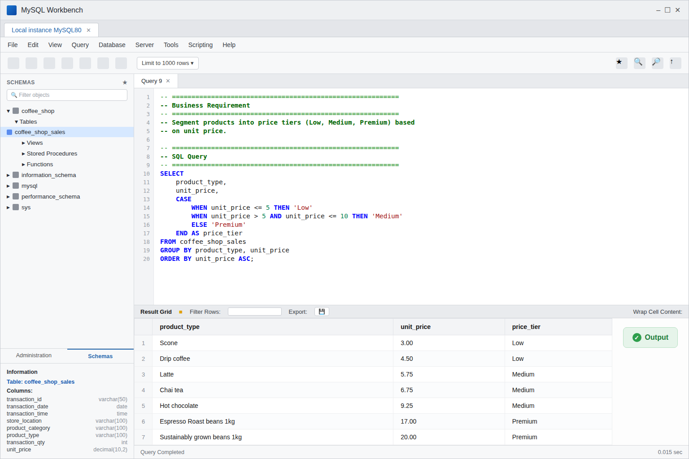

---

## Summary

- **Overall performance:** $698,812 in revenue across 149,116 transactions (~$4.69 avg. per transaction)
- **Top store:** Hell's Kitchen ($236,511), narrowly ahead of Astoria and Lower Manhattan
- **Top category:** Coffee ($269,952), followed by Tea ($196,406)
- **Peak month:** June 2023 ($166,486), with a steady climb from February
- **Peak hours:** 8–10 AM, led by 10 AM ($88,673)
- **Best day:** Monday ($101,677), though the week is fairly balanced
- **Store specialties:** Hell's Kitchen (Coffee), Lower Manhattan (Bakery), Astoria (Drinking Chocolate)
- **Price tiers:** Most everyday items (drinks, bakery) fall in Low/Medium; packaged coffee beans sit in Premium
